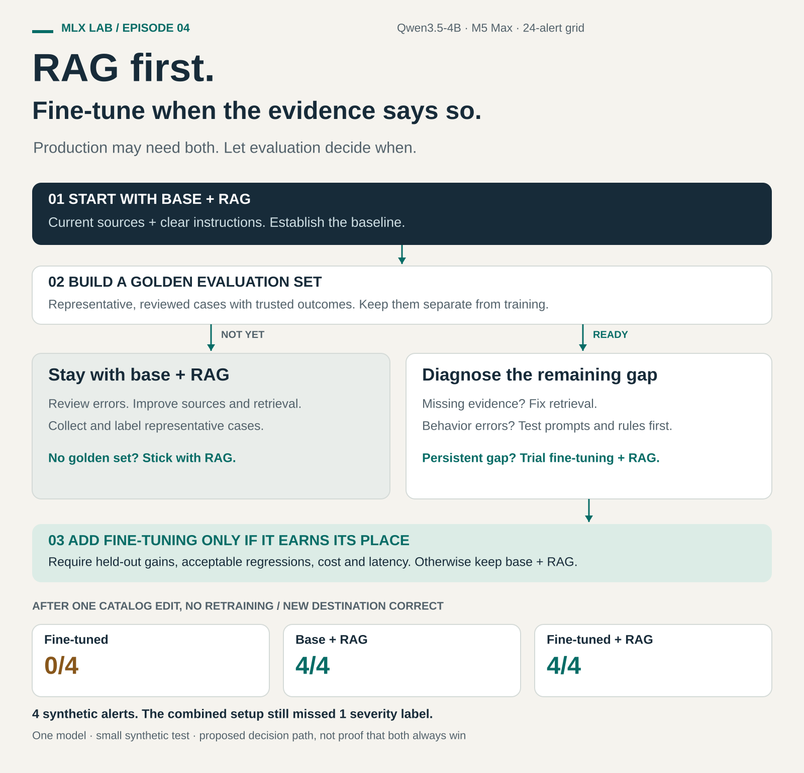

# RAG or fine-tuning? One agent, four configurations, one catalog change.

The RAG vs fine-tuning debate often ends with a team picking a side. One approach becomes the architecture, and every failure becomes a reason to invest more in it.

For a production system, I want to ask a different question: what is failing, and what evidence would justify the next change?

So which approach would I choose for an incident-triage agent? I ran Qwen3.5-4B four ways to find out.

## The rule everyone quotes

Paolo Perrone puts the distinction this way in [RAG vs Fine-Tuning](https://theaiengineer.substack.com/p/rag-vs-fine-tuning):

> RAG changes what the model sees at answer time; fine-tuning changes how it behaves.

Clean rule. Does it survive a real task?

## One triage agent, built four ways

I built the experiment around NimbusCart, a fictional organization with six services. An alert goes in; a JSON record comes out with severity, affected service, probable cause, runbook reference, escalation destination, and an escalation flag.

Think of that record feeding downstream automation: the agent decides where the incident should go, and nobody reads each answer before the next step acts on it. That is the production scenario this task represents. The experiment itself ran offline on synthetic alerts; no real incidents were routed.

This is a task you could plausibly demo with either approach. Retrieval can supply the service catalog and runbooks. Fine-tuning can learn from examples of completed triage records. I tested both, separately and together: base, base + RAG, fine-tuned, and fine-tuned + RAG.

I ran Qwen3.5-4B locally on an M5 Max. The adapter used 360 synthetic training examples and 40 validation examples. Retrieval selected three chunks from eight documents using TF-IDF. I evaluated 24 alerts with deterministic scoring and no LLM judge.

## The first snapshot: fine-tuning sweeps the measured columns

| Configuration | JSON compliance | Severity correct | Fact fields correct |
|---|---|---|---|
| Base | 24/24 · 100% | 17/24 · 71% | 24/72 · 33% |
| Base + RAG | 24/24 · 100% | 18/24 · 75% | 66/72 · 92% |
| Fine-tuned | 24/24 · 100% | 24/24 · 100% | 72/72 · 100% |
| Fine-tuned + RAG | 24/24 · 100% | 21/24 · 88% | 70/72 · 97% |

Fact accuracy counts three exact-match fields per alert: service, runbook reference, and escalation destination. It is not whole-answer accuracy. Severity is scored separately; these columns do not establish that every decision field is correct.

This is the cell that could get promoted to production: fine-tuning alone, with 100% across the measured columns. But the training examples already contained the organization’s facts, and the evaluation reused the training templates with different values and a new region. Perfect performance here is compatible with memorizing familiar patterns. The table rewards getting the original world right. The next test changes that world.

Base + RAG made a substantial improvement without training: fact accuracy rose from 33% to 92%. All four configurations already passed the JSON compliance check. There was no demonstrated need to fine-tune for JSON formatting in this run.

## Then I changed the catalog

Checkout moved from team-atlas to team-borealis. Its destination changed from #atlas-oncall to #borealis-oncall. I reran four checkout alerts against the updated documents. No retraining.

| Configuration | New destination correct | Severity correct |
|---|---|---|
| Base + RAG | 4/4 | 3/4 |
| Fine-tuned | 0/4 | 4/4 |
| Fine-tuned + RAG | 4/4 | 3/4 |

The fine-tuned model kept returning #atlas-oncall. Both retrieval configurations returned the new destination on all four alerts.

The JSON still passed the compliance check. The destination was wrong. In an autonomous workflow, a record like this could pass a format validator and send an incident to the former team’s channel without a person reviewing it first. A healthy-looking response can still be an outdated decision.

The combined configuration still missed one severity label. It did not outperform base + RAG on these two reorg measures. That matters: the lesson cannot simply be to choose the fourth configuration instead.

## So why not just retrain?

I could update the training data and train again. In this dataset, 62 of the 360 training examples contain the old checkout destination. A corrected adapter would then need evaluation and deployment. With retrieval, the correction starts in the catalog, followed by whatever refresh the retrieval system requires.

In a production organization, the service owner can update that source as part of the ownership change. Updating an adapter also brings in the team that owns the training pipeline. The question becomes whether a routine catalog change should require a new model release.

A format check would not have caught this mistake. An evaluation with the new destination would. That is why the source of truth and the evaluation must move with the organization, whichever model serves the request.

## What I would build first

After this experiment, my starting point for this kind of agent is base + RAG with an explicit task prompt. It improved fact accuracy from 33% to 92% without training, and followed the checkout update. I would keep owners, destinations, runbooks, and changing policies in maintained sources, then check that retrieval finds the right evidence and the model uses it.

Before adding an adapter, I would build the evaluation that can tell me whether it helps.

By a golden set, I mean a versioned, human-reviewed collection of representative inputs, expected answers or scoring rubrics, and the source facts or policy version used to judge them. It must be separate from the examples used to train the model.

For this triage task, I would include ordinary incidents, ambiguous alerts, missing documents, changed owners, conflicting old and new information, and cases where the correct action is to abstain or ask for review. Labels should reflect realistic alert values and an agreed escalation policy.

The 24 synthetic evaluation alerts in this episode are a useful experimental check. They are not that production golden set.

Without a trusted set, I cannot reliably tell whether a fine-tune fixes a recurring problem, memorizes examples, or introduces regressions. I would keep the base + RAG approach, review its errors, and use those reviews to build the set. RAG needs evaluation too; it simply gives me a baseline to improve while the evidence develops.

**No golden set? Stick with RAG while you build one.** That is a gate for adding fine-tuning; RAG still needs evaluation before production use.

Once the set is ready, diagnose the remaining errors. Missing or stale evidence points toward the sources and retrieval pipeline. Repeated mistakes with adequate evidence call for clearer instructions, examples, or output validation. For a deterministic escalation rule, ordinary code may be the simplest implementation.

If a behavior gap survives those fixes, trial fine-tuning on separate, reviewed examples. Include retrieved context and cases where current documents supersede older facts. Compare base + RAG against fine-tuned + RAG on held-out cases, including catalog changes. Require a meaningful behavior gain, acceptable regressions, and serving cost and latency that fit the application. Otherwise, keep base + RAG.

Production may need both: retrieval for current evidence, fine-tuning for behavior that demonstrably improves with training. The evaluation decides when to make that move.

## What this run cannot settle

The evaluation reused 24 training templates. Some generated values were unrealistic, including a 5xx rate above 9,000%, which complicates interpretation of severity mistakes. The adapter may have learned to follow alert tags while the base model reacted to the contradictory numbers. A cleaner experiment is needed to estimate that effect.

Several runbook errors matched document filenames from the retrieved context instead of canonical runbook IDs. That suggests a context-format issue worth testing; it does not explain all severity errors. The combined setup scored below fine-tuning alone on the original snapshot, so combining the techniques is not an automatic improvement.

The run used one model, one seed, eight documents, and four reorg cases. It did not establish retrieval freshness guarantees, production reliability, or the best architecture for other tasks. Tuned configurations decoded at about 91–92 tokens/s versus 167–168 for base configurations with the adapter unfused; fusion with mlx_lm.fuse was not measured.

This experiment did not compare an improved policy prompt or a rules-based severity classifier against the adapter. The severity gap therefore cannot establish that training was necessary.

My next experiment would use realistic values, unseen alert families, a stronger prompt baseline, and explicit context-conflict cases. Those comparisons would help decide whether to add an adapter to this RAG system.

**Start with base + RAG. Build the golden set. Add fine-tuning when it earns its place. Keep evaluating both.**

## Sources and experiment artifacts

The framing was prompted by [Paolo Perrone’s RAG vs Fine-Tuning](https://theaiengineer.substack.com/p/rag-vs-fine-tuning). The sequencing and golden-set gate are my proposed engineering approach, not a result measured by this experiment.

The measured results come from the local [24-alert grid](../../results/ep04-grid.json), [four-alert reorg run](../../results/ep04-reorg.json), and [scoring implementation](../../bench/ep04_score.py). The [evaluation runner](../../bench/ep04_eval.py) records the comparison setup. Public project: [MLX Lab](https://github.com/Suryals/mlx-lab).
